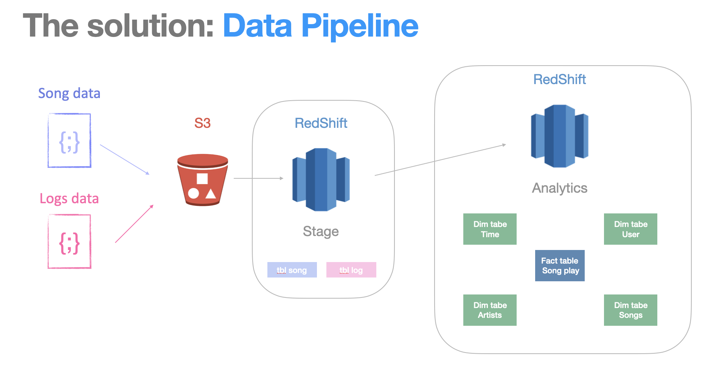

# AWS Pipeline processing

## Running this script:

In order to run this script you will need to following requirements:
1) Have Python 3 installed in the computer with pandas, boto3, json, and jupyter libraries installed;
1) Create a file called keysecret.cfg (see content of the file after this list);
2) Save all files into the same folder;
3) Run *Setup Redshift.ipynb* with a Jupyter Notebook interpreter;
4) In the terminal, run *python3 create_tables.py* and then *python3 create_tables.py* 

*keysecret.cfg* content:

    [AWS]
    KEY=INSERT_HERE_YOUR_AMAZON_KEY
    SECRET=INSERT HERE YOUR AMAZON KEY

## Purpose of this database 

Discuss the purpose of this database in context of the startup, Sparkify, and their analytical goals.

Sparify is a streaming startup that is growing its user base and database and wish to move their database to the cloud. They used to store their data in JSON files in their on-prem servers. The data was made available in S3 buckets in order to be transitioned into a RedShift DataWarehouse.

This project is composed of an ETL pipeline that extracts data from S3, stages them in RedShift, and transforms data into a set of dimensional tables for their analytics team to continue finding insights in what songs their users are listening to. 

## Database schema design and ETL pipeline

This project's final objective is to transfor raw JSON files into a DataWarehouse. This is done with the design and implementation of a Data Pipeline that works in two stages:

1) Import data from S3 into staging tables in RedShift
2) Transformation of data from the staging tables into a Star Schema design 

The final Schema for the Database is the Start Schema because this schema is designed for On Line Analytical Processing, which is the format that facilitates the retrieval of information by the Business Analysts. 

The Star Schema is achieved when we assemble a Facts Table in the center of the schema, this table contains the business events that are central to the analysis. In this case the fields of the *fact* table are:
* Start time
* User_id
* Level
* Song_id
* Artist_id
* Session_id
* Location
* User_agent

The rest of the information is organized in peripherical tables containf information grouped by the dimension of the data, called "dimension tables". These are the *dimension* tables and their fields:

*users*:
* user_id
* first_name
* last_name
* gender
* level

*songs*:
* song_id
* title
* artist_id
* year
* duration

*artists*:
* artist_id
* name
* location
* latitude
* longitude

*time:
* start_time
* hour
* day
* week
* month
* year
* weekday

***Here is a visual representation of the pipeline:***

## Files in the repository

The origin repository is comprised of two sets of files: 

**1) Song Dataset**
The first dataset is distributed among various JSON formated files containing metadata about a song and the artist of that song.

**2) Logs Dataset**
The second dataset consists of log files in JSON format with simulated app activity logs from the music streaming app.

## Example queries and results for song play analysis

Retrieve only song title and artist released in 1994:

    SELECT ts.title as SongTitle, ta.name as Artist
    FROM
    songplays tsp
    JOIN songs ts ON tsp.song_id = ts.song_id
    JOIN artists ta ON tsp.artist_id = ta.artist_id
    WHERE ts.year = 1994

Result:

| songtitle                             | artist                 | 
| :---                                  |    :----:              |
| Wax on Tha Belt (Baby G Gets Biz)     | The Waterboys          |
| Bury My Heart                         | Usher                  |

Retrieve only songs played on Thursdays:

    SELECT ts.title as SongTitle, ta.name as Artist 
    FROM
    songplays tsp
    JOIN songs ts ON tsp.song_id = ts.song_id
    JOIN artists ta ON tsp.artist_id = ta.artist_id
    JOIN times tt ON tsp.start_time = tt.start_time
    WHERE tt.weekday = 4

Result:

| songtitle                             | artist                 | 
| :---                                  |    :----:              |
| Baja por diversion (directo 05)       | La Fuga                |
| Hey Daddy (Daddy's Home)              | Usher                  |
